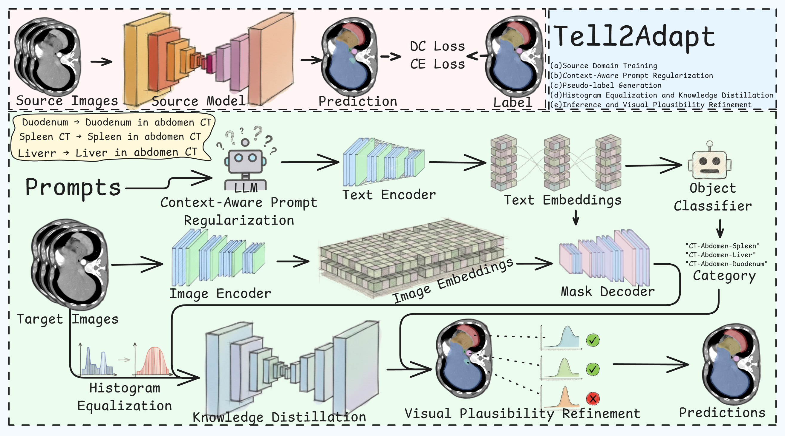
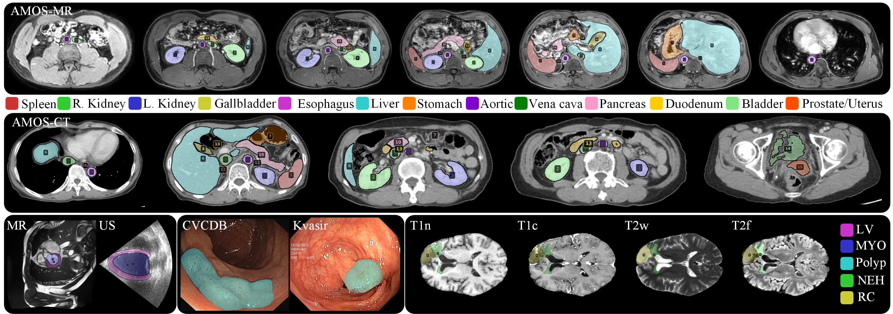

# Tell2Adapt: A Unified Framework for Source Free Unsupervised Domain Adaptation via Vision Foundation Model



## Environment Setup

### Clone BiomedParse Repository
```bash
git clone https://github.com/microsoft/BiomedParse.git
cd BiomedParse
```

### Create Conda Environment
```bash
conda create -n biomedparse_v2 python=3.10.14
conda activate biomedparse_v2
```

### Install Dependencies
```bash
pip install -r assets/requirements/requirements.txt

# Note: The above requirements file assumes your environment uses CUDA 12.4
# Please adjust accordingly for your system/environment

pip install azureml-automl-core
pip install opencv-python
pip install git+https://github.com/facebookresearch/detectron2.git
```

## Data Preparation

### Data Format Requirements

The input data should be a npz file containing three keys:

- `imgs`: Image data
- `gts`: Ground truth segmentation masks
- `text_prompts`: Text prompts for each image

### Convert nnUNet Format to BiomedParse Format

Use the provided conversion script to transform nnUNet format data into BiomedParse compatible format:
```bash
python nnUNet2BiomedParse.py
```

**Note**: Please refer to `nnUNet2BiomedParse.py` for detailed implementation and data structure specifications.

## Context-Aware Prompts Regularization

### Configuration

Before running the prompt regularization, configure your API credentials in `Prompt_regulization.py`:
```python
api_key = "your_api_key_here"
base_url = "your_base_url_here"
```

### Meta-Prompt

The meta-prompt mentioned in our paper is already integrated into `Prompt_regulization.py`. You can modify it according to your specific requirements.

## Pseudo Label Generation

Generate pseudo labels using BiomedParse with the regularized prompts:
```bash
python inference.py
```

This script will:
- Load the preprocessed data
- BiomedParse inference with CAPR
- Generate pseudo labels for knowledge distillation

## Knowledge Distillation

### Convert Pseudo Labels to nnUNet Format

Convert the generated pseudo labels back to nnUNet format for knowledge distillation training:
```bash
python BiomedParse2nnUNet.py
```

### Train the Adapted Model

Execute the knowledge distillation training script:
```bash
bash Knowledge_Distillation.sh
```


## Visual Plausibility Refinement

After the adapted model produces predictions, VPR removes anatomically implausible connected components using statistical priors pre-computed from
BiomedParse (Section 3.3 of the paper).

### How It Works

For each segmentation component $p_i$ the log-space plausibility score is:

$$
\log S(p_i) = \sum_{k=1}^{4} \left[ (\alpha_k-1)\log f_{i,k} + (\beta_k-1)\log(1-f_{i,k}) - \log B(\alpha_k, \beta_k) \right]
$$
Components with 
$$
\log S(p_i) < \mu_S - 2\sigma_S
$$
 are discarded.

### Input Format

VPR expects the prediction `.npz` files produced by nnUNet (via `BiomedParse2nnUNet.py`). Each file must contain a `probabilities` key with shape, you need to extract the probabilities from Tell2Adapt/src/model/biomedparse_3D.py. The corresponding raw image must be a NIfTI file (`.nii.gz` or `.nii`) in a separate directory.

### Available Modalities

The priors are stored in `Anatomical_Priors.json`, included in the repository. Supported modality keys:

| Key | Description |
|---|---|
| `CT-Abdomen` | CT abdominal organs |
| `CT-Chest` | CT chest (nodule, tumour, COVID-19) |
| `CT-Liver` | CT liver (vessel, tumour) |
| `MRI-Abdomen` | MRI abdominal organs |
| `MRI-Cardiac` | MRI cardiac (LV, RV, myocardium) |
| `MRI-FLAIR-Brain` | FLAIR brain (edema, tumour core, whole tumour) |
| `MRI-T1-Gd-Brain` | T1-Gd brain (enhancing / non-enhancing tumour) |
| `Pathology` | Histopathology cell types |
| `X-Ray-Chest` | Chest X-ray (lungs, pneumonia) |
| `Ultrasound-Cardiac` | US cardiac (LA, LV) |
| `Endoscopy` | Polyp / neoplastic polyp |
| `Fundus` | Optic cup / disc |
| `Dermoscopy` | Skin lesion / melanoma |
| `OCT` | Retinal edema |

### Usage

Edit the `__main__` block in `VisualPlausibilityRefinement.py`:

```python
from VisualPlausibilityRefinement import PriorDistributionRefiner

refiner = PriorDistributionRefiner(prior_json_path="Anatomical_Priors.json")

# Map channel index → organ name (must match a key inside the chosen modality)
# Channel 0 is typically background; leave it as an empty string to skip.
object_mapping = {
    0: "",            # background — no prior, kept as-is
    1: "liver",
    2: "spleen",
    3: "right kidney",
    4: "left kidney",
}

refiner.process_directory(
    input_dir="nnUNet_predictions",   # folder with .npz probability files
    output_dir="vpr_refined",         # refined .npz files are written here
    image_dir="raw_images",           # folder with .nii.gz / .nii images
    modality="CT-Abdomen",            # one of the keys in Anatomical_Priors.json
    object_mapping=object_mapping,
    min_component_size=20,            # components smaller than this are always dropped
    pattern="*.npz",
)
```

Then run:
```bash
python VisualPlausibilityRefinement.py
```

The refined `.npz` files have the same structure as the inputs and can be directly converted to nnUNet labels via `BiomedParse2nnUNet.py`.



## TODO

- [x] Provide all source code for reproduct 
- [ ] Add evaluation scripts for segmentation metrics
- [x] Provide pre-trained model [nnUNet checkpoints](https://drive.google.com/file/d/1p6qi5SVRZon-5lVvazllTf6Uc8oIzFPJ/view?usp=sharing)
- [ ] Include ablation study scripts

## Citation

If you find this work useful in your research, please consider citing:
```bibtex

```

## Acknowledgements

We would like to thank:

- [BiomedParse](https://github.com/microsoft/BiomedParse)
- [nnUNet](https://github.com/MIC-DKFZ/nnUNet)
